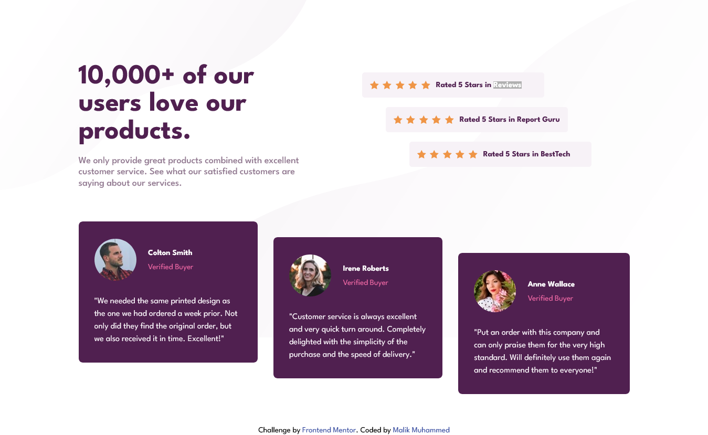

# Frontend Mentor - Social proof section solution

This is a solution to the [Social proof section challenge on Frontend Mentor](https://www.frontendmentor.io/challenges/social-proof-section-6e0qTv_bA). Frontend Mentor challenges help you improve your coding skills by building realistic projects.

## Table of contents

- [Overview](#overview)
  - [The challenge](#the-challenge)
  - [Screenshot](#screenshot)
  - [Links](#links)
- [My process](#my-process)
  - [Built with](#built-with)
  - [Continued development](#continued-development)
- [Author](#author)
- [Acknowledgments](#acknowledgments)

## Overview

### The challenge

Users should be able to:

- View the optimal layout for the section depending on their device's screen size

### Screenshot

### Links

- Solution URL: (https://github.com/Malik-Muhammed/social-proof-section)
- Live Site URL:()

## My process

### Built with

- HTML5 markup
- Flexbox
- Mobile-first workflow

### Continued development

- improvement on my mobile-first workflow
- improvement on my layout approach

## Author

- Frontend Mentor - [@Malik-Muhammed](https://www.frontendmentor.io/profile/Malik-Muhammed)
- Twitter - [@maliqlanre](https://twitter.com/maliqlanre)
